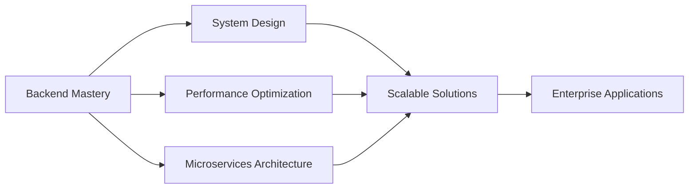

<div align="center">
  
</div>

<div align="center">
  
  [](https://www.linkedin.com/in/gusti-bisman/)
  [](mailto:gustibisman2308@gmail.com)
  [](https://www.instagram.com/gustibismantaka/)
  
</div>

---

## 👨‍💻 About Me

<table style="width: 100%; table-layout: fixed; border-collapse: collapse;">

<tr width="100%">
    <td style="padding: 0;">

```java
    @Service
    public class GustiBisman {

        @Value("${location}")
        private String base = "Tangerang Selatan 🇮🇩";

        @Value("${role}")
        private String currentRole = "Full Stack Developer";

        @Value("${company}")
        private String company = "Cartenz Group";

        @Autowired
        private List<String> strengths = Arrays.asList(
            "Designing APIs that scale gracefully",
            "Translating complex requirements into clean code",
            "Debugging production issues with a calm mindset",
            "Building systems with performance awareness"
        );

        private final Set<String> principles = Set.of(
            "Clean code over clever code",
            "Readability is a feature",
            "Optimize when evidence says so",
            "Stability beats hype"
        );

        private boolean readyToShip() {
            return tests.green() && metrics.lookGood();
        }

        public void workMode() {
            while (coffee.isAvailable()) {
                design();
                implement();

                if (readyToShip()) {
                    refactor();
                    ship();
                } else {
                    investigate();
                }
            }
        }
    }
```

  </td>
</tr>
<tr width="100%">
    <td style="padding: 0;">

    ### 🎯 My Craft

    **Backend Sorcery** 🧙‍♂️
    - Conjuring scalable systems with Spring Boot
    - Taming databases with surgical precision
    - Architecting APIs that never sleep

    **DevOps Alchemy** 🔮
    - Containerizing apps with Docker magic
    - Orchestrating Linux servers like a symphony
    - Making Nginx dance at 25% faster tempo

    **Problem Solving** 🎪
    - Debugging like Sherlock Holmes
    - Optimizing code like a Formula 1 pit crew
    - Building features with <2% revision rate

    **Current Quest** 🗡️
    > Mastering microservices architecture while keeping 98% uptime alive and kicking!

    </td>
</tr>
</table>

---

## 🛠️ Tech Arsenal

<details open>
<summary><b>💻 Core Languages</b></summary>
<br>


</details>

<details open>
<summary><b>🎨 Frontend Development</b></summary>
<br>


</details>

<details open>
<summary><b>⚙️ Backend & Framework</b></summary>
<br>


</details>

<details open>
<summary><b>🗄️ Database & ORM</b></summary>
<br>


</details>

<details open>
<summary><b>☁️ DevOps & Infrastructure</b></summary>
<br>


</details>

---

## 📊 GitHub Analytics

<div align="center">
  
  
</div>
<div align="center">
  
</div>
<!-- 
<div align="center">
  
</div> -->

---

## 📈 Contribution Graph

<div align="center">
  
</div>

---


## 🏆 GitHub Stats

<div align="center">
  
  
</div>
<div align="center">
  
</div>

---

## 🎯 Current Focus



**Currently Working On:**
- 🔄 Advanced Spring Boot patterns and best practices
- 📊 Database performance tuning and optimization
- 🏗️ Microservices architecture and API design
- ☁️ Cloud-native application development
- 🔐 Security hardening and authentication systems

---

## 💡 Engineering Philosophy

> "Make it work, make it right, make it fast." – Kent Beck

I believe in:
- 🎯 **Performance First** - Optimizing for speed and efficiency
- 🏗️ **Scalable Architecture** - Building systems that grow
- 🔒 **Security by Design** - Implementing best practices from the start
- 📊 **Data-Driven Decisions** - Metrics guide improvements
- 🧪 **Test Everything** - Quality through comprehensive testing
- 📚 **Clean Code** - Maintainable, readable, and well-documented
- 🤝 **Collaborative Growth** - Learning and sharing knowledge

---

## 📫 Let's Connect!

I'm always open to interesting conversations and collaboration opportunities. Whether you want to discuss:
- 💼 Job opportunities
- 🚀 Project collaborations
- 💡 Tech discussions
- 🤝 Knowledge sharing

Feel free to reach out through any of the platforms above!

---

<div align="center">
  
  ### 💭 Random Dev Quote
  
  
  
  ---
  
  **⭐ From [MrBista](https://github.com/MrBista) with 💙**
  
</div>
